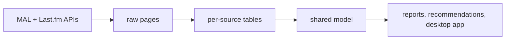

# Taste Engine

A desktop app that pulls my anime list (MyAnimeList) and listening history (Last.fm) into one SQLite database, shows how my taste compares to everyone else's, and suggests what to watch and listen to next. It runs on my own computer and keeps everything there.



## Run it

**Windows:** download the latest zip from [Releases](../../releases), unzip it, and double-click `taste-engine.exe`. Windows warns the first time because the exe isn't signed: click **More info**, then **Run anyway**.

**From source** (Python 3.10+):
```
pip install -r requirements.txt
python -m taste.desktop
```

## Use it

1. Create a profile. Each profile has its own keys, settings, and data.
2. On **Settings**, enter your usernames and API keys: a [MAL client ID](https://myanimelist.net/apiconfig) and a [Last.fm API key](https://www.last.fm/api/account/create). Use **Test connection** to check them.
3. On the **Dashboard**, click **Sync everything**. The first time, it also fetches what the recommendations need, which takes a few minutes for a big list. After that it's seconds.
4. The **Dashboard** shows what I finished lately, the albums on repeat this month, how I score compared to the MAL crowd, and which genres I'm most generous or harshest with.
5. **For You** has anime suggestions, each with a predicted score for me next to the MAL mean, the chance I'd give it an 8 or more, and a one-line reason in plain words ("Because you loved A and really liked B"). Music has new artists to try, labeled Strong match, Good match, or Worth a try, and old favorites to rediscover.
6. **Reports** is all charts: my score against MAL's for every show, where I tend to drop shows, genre leans, plays per month, top artists and tracks, and plays by hour and day. The numbers behind them are in **Export CSV**, one report at a time or all at once.

The sidebar collapses to icons with the button at its top or **Ctrl+B**, and the app remembers which way I left it.

Keys are stored in Windows Credential Manager, never in plain text on Windows or macOS, and never shown again after saving. Data lives in `%LOCALAPPDATA%\taste-engine` for the packaged app, or `data/` when run from source.

There's also a command line:
```
python -m taste --profile me sync all
python -m taste --profile me report
python -m taste --profile me status
python -m taste profiles
```

## How the anime suggestions work

Candidates are shows that MAL users recommend alongside shows I scored above my own average, plus sequels and related shows of things I liked. Each one gets a predicted score for me in two steps:

1. **Start from the MAL mean.** With 30 or more scored shows, the app fits my score as a straight line in the MAL mean instead of just subtracting my usual difference. A harsh critic is often harsher on weak shows than on strong ones, and a line captures that. With fewer shows a fitted line swings too much, so it stays a plain shift.
2. **Add my leans.** What's left after step 1 is averaged per genre and per studio, so a show gets a bump for genres and studios I rate above that baseline. Small samples are pulled toward zero, so one show can't swing a whole genre.

To check that this beats simply trusting MAL, the app hides a fifth of my scored shows, predicts them, and compares the error with the MAL mean alone. The result is shown on the For You page, so I can see whether the personal part actually helps.

Predictions are averages, so they rarely reach the top of the scale. That's why each card also says how likely I am to give the show an 8 or more. The app predicts each of my scored shows without its own score (in five rounds), looks at how far my real scores landed from those predictions, and applies the same spread to the new show. It's left out when I have fewer than 20 scored shows.

The reason on each card names the shows I liked that point to it, using English titles when MAL has one. The vote counts and genre numbers behind it are in the card's tooltip.

## Known limitations

- **Last.fm only sees what scrobbles to it.** For most of my history that was desktop plays only (Tidal on my PC). My phone scrobbles now too, so newer plays cover more of my listening than older ones, and comparisons across that change aren't even. Either way it's a sample, not my full listening history. Each profile sets its own capture scope, every play keeps the scope it was synced under, and every Last.fm report and music suggestion says which scope applies.
- **The MAL list has to be public.** The app uses a client ID only, no login.
- **MAL watch dates are self-reported and often blank.** A completed show without a finish date gets the date I last edited the entry instead, labeled as an estimate. Those estimates cluster on days I bulk-edited my list, so "Recently finished" can show a batch of shows from the same day.
- **Tracks are matched by artist and title**, because MusicBrainz IDs are often missing. Different spellings of the same song count as different tracks.
- **Last.fm has no artist photos.** It returns the same blank image for every artist, so an artist's picture is the cover of their most played album (or their top album, for artists I've never played). When Last.fm has no cover at all, the picture is a photo from Deezer, and a Deezer photo also stands in when a cover can't be downloaded. Only an exact name match counts, so a few artists still get a lettered placeholder rather than a photo of someone else.
- **Music suggestions only know what Last.fm thinks is similar.** They come from Last.fm's similar artists, weighted by how much and how recently I play each artist.
- **No matching across sources yet** (for example an anime and its soundtrack).

## Credits

- Built with Python and [Qt for Python](https://doc.qt.io/qtforpython/) (PySide6, used under the LGPL 3.0), plus [requests](https://requests.readthedocs.io/), [keyring](https://github.com/jaraco/keyring), [python-dotenv](https://github.com/theskumar/python-dotenv), and [tzdata](https://github.com/python/tzdata).
- Fonts: [Space Grotesk](https://github.com/floriankarsten/space-grotesk) and [Inter](https://rsms.me/inter/), both under the SIL Open Font License.
- Anime data and posters come from [MyAnimeList](https://myanimelist.net/), music data and album covers from [Last.fm](https://www.last.fm/), and artist photos from [Deezer](https://www.deezer.com/) when Last.fm has none. Taste Engine isn't affiliated with any of them.
- The Windows download includes the full license texts in `THIRD_PARTY_NOTICES.txt`.

## Privacy

Everything the app collects stays in files on my computer. It talks to three services: MyAnimeList and Last.fm, with my usernames and API keys, to fetch my list and plays; and Deezer's public artist search, which gets the names of suggested artists (no key or account) to find their photos. Pictures are downloaded only from those services' image servers. Nothing else leaves the computer.

## More

- [docs/DATA_DICTIONARY.md](docs/DATA_DICTIONARY.md): every table and column
- Tests: `pytest` (they never call the real APIs)
- License: MIT
