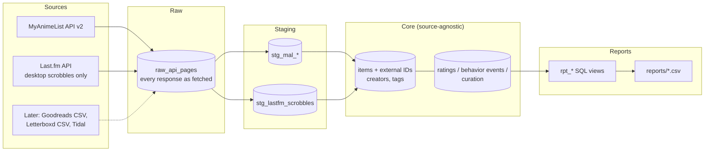

# Taste-Engine

This is a personal portfolio project. It pulls my media history (anime, music, and later books and films) from the services I actually use into one database, so I can look at my own taste with SQL instead of guessing at it. The question I started with: how critical am I compared to everyone else, and where? Later on, I want it to recommend things that fit how picky I actually am, not just what's popular.

It only reads my own accounts. Everything it reads is either public (my MyAnimeList list) or mine (my Last.fm scrobbles). It's non-commercial, and no data is shared or resold. The database and report output stay on my machine and are gitignored.

**Phase 1** covers MyAnimeList and Last.fm. Goodreads, Letterboxd, Tidal, and maybe Crunchyroll come later. The schema is built so they slot in without a redesign.

## How it works



There are three layers, and each one has a job:

- **Raw** keeps every API page exactly as it came back. If I change how something is parsed, I can rebuild from raw without calling the APIs again.
- **Staging** has one set of tables per source with cleaned-up fields. A MAL score of 0 becomes NULL here, because 0 on MAL means "not scored," not "terrible."
- **Core** is the part every source shares. It splits what I know into three kinds of signal, kept deliberately separate:
  - **Ratings**, what I thought: raw score, the source's scale, and a 0 to 1 normalized score so different scales compare fairly.
  - **Behavior events**, what I actually did: plays and watches with timestamps.
  - **Curation**, what I chose to save or list: list statuses now, favorites and shelves later.

Items get IDs from each source through an external IDs table. That's where matching the same title across sources (entity resolution) will plug in later. Phase 1 doesn't attempt it.

The full design and the decisions behind it are in [docs/PLAN.md](docs/PLAN.md). Every table and column is described in [docs/DATA_DICTIONARY.md](docs/DATA_DICTIONARY.md).

## Setup

You need Python 3.10 or newer, a MyAnimeList client ID ([create one here](https://myanimelist.net/apiconfig)), and a Last.fm API key ([create one here](https://www.last.fm/api/account/create)).

The app reads four environment variables:

| Variable | What it is |
|---|---|
| `MAL_CLIENT_ID` | MAL API client ID, sent as the `X-MAL-CLIENT-ID` header |
| `MAL_USERNAME` | the MAL user whose list to read (the list has to be public) |
| `LASTFM_API_KEY` | Last.fm API key |
| `LASTFM_USERNAME` | the Last.fm user whose scrobbles to read |

Keys are never printed, logged, or stored in the database, and error messages are scrubbed before they're saved.

### Local (Windows)

```powershell
git clone <this repo's URL> taste-engine
cd taste-engine
py -m venv .venv
.venv\Scripts\activate
pip install -r requirements.txt
copy .env.example .env
notepad .env
```

Fill in the four values in `.env` and save. `.env` is gitignored. If the variables are already set in your environment, the `.env` file is optional.

### Claude Code cloud session

The variables come from the cloud environment's settings, so no `.env` is needed. A SessionStart hook (`.claude/hooks/session-start.sh`) installs `requirements.txt` when a cloud session starts. It does nothing on a local machine.

## Usage

```
python -m taste sync mal       # pull my full MAL list (upserts, safe to re-run)
python -m taste sync lastfm    # pull new scrobbles (first run pulls everything)
python -m taste sync all       # both
python -m taste report         # print a summary and write reports/*.csv
python -m taste status         # row counts per table and last sync per source
```

Every command takes `--db PATH` if you want a database other than `data/taste.db`.

The Last.fm sync prints `page X of Y` as it goes. If it's interrupted (network drop, Ctrl+C, closed laptop), the next run picks up where it stopped, with no duplicates and no gaps. That works because each run fetches a fixed time window and records how far it got, so it never just asks for "anything newer than my latest scrobble." PLAN.md section 4.2 explains why that simpler approach would leave holes.

### Reports

`python -m taste report` writes these to `reports/` (gitignored):

| File | What it answers |
|---|---|
| `mal_critic_summary.csv` | How critical am I overall? My average vs the community average, and how often I score below it. |
| `mal_score_vs_community.csv` | Every anime I scored, next to the MAL community mean. |
| `mal_genre_vs_community.csv` | Genres where I score above or below the community (only genres with at least 5 scored shows). |
| `mal_dropped_on_hold.csv` | What I dropped or put on hold, and how far I got. |
| `lastfm_top_artists_*.csv`, `lastfm_top_tracks_*.csv` | Top artists and tracks all time, by year, and by month. |
| `lastfm_by_hour.csv`, `lastfm_by_weekday.csv` | When I listen, in America/Phoenix time. |

Every Last.fm report has a `data_scope` column saying it covers desktop listening only (see below).

## Known limitations

- **Last.fm only sees my desktop listening.** I listen on Tidal, and only the desktop app scrobbles to Last.fm. Anything I play on my phone never reaches it. So the Last.fm data is a sample of my listening, skewed toward whatever I play at my computer, and **it is not my full listening history**. Every Last.fm event is stored with `capture_scope = 'desktop_only'`, and every Last.fm report says so. Read "top artists" as "top artists while I'm at my desk."
- **MyAnimeList needs a public list.** The app uses a client ID only, no OAuth, so it can only read a public list. A private list would need OAuth, which is out of scope for Phase 1.
- **MAL watch dates are self-reported and often missing.** Start and finish dates are whatever I typed into MAL, and I usually don't fill them in. When a completed show has no finish date, the app uses the last time I edited the entry as a stand-in, labeled `time_basis = 'fallback_list_updated_at'`. Those stand-ins cluster badly: one big editing session touched most of my list, so most of the fallback dates land on that one day. They're kept on purpose (nothing is skipped), but any timeline built from MAL events should filter on `time_basis = 'user_entered'` or treat the fallbacks as "finished on or before this date." Start dates have no fallback.
- **The MAL community mean changes over time.** I store the latest value with an `observed_at` timestamp, not a history.
- **MAL's genre list mixes genres, themes, and demographics** (Action, Isekai, Shounen) in one list. They're all stored as genres.
- **Last.fm track identity is name-based.** MusicBrainz IDs are often empty, so a track is identified by artist and title, case-insensitively. Different spellings of the same song ("feat." credits, remaster tags) count as different tracks. The display name is the spelling from the oldest scrobble.
- **No cross-source matching yet.** An anime and its soundtrack, or a book and its film, aren't linked. The external IDs table is ready for it.
- **SQLite first.** The SQL is written to port to SQL Server with small changes. The differences are listed in [docs/PORTABILITY.md](docs/PORTABILITY.md).

## Development

```
pip install -r requirements.txt
ruff check . && ruff format --check .
pytest
```

The tests never call the live APIs. They use made-up fixture JSON in `tests/fixtures/` and a fake HTTP layer, and a guard fixture fails any test that tries a real request. They cover pagination for both sources, skipping the now-playing track, MAL score 0 becoming NULL, re-syncing without duplicates, Last.fm incremental sync and resuming after a crash, and backoff on rate-limit errors.

Project conventions for future work are in [CLAUDE.md](CLAUDE.md).
