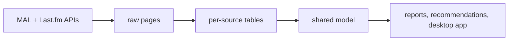

# Taste Engine

A desktop app that pulls my anime list (MyAnimeList) and listening history (Last.fm) into one SQLite database, shows how my taste compares to everyone else's, and suggests what to watch and listen to next. Everything runs and stays on my own computer.



## Run it

**Windows:** download the latest zip from [Releases](../../releases), unzip it, and double-click `taste-engine.exe`. Windows warns the first time because the exe isn't signed: click **More info**, then **Run anyway**.

**From source** (Python 3.10+):
```
pip install -r requirements.txt
python -m taste.desktop
```

## Use it

1. Create a profile. Each profile has its own keys, settings, and data.
2. On **Settings**, enter your usernames and API keys: a [MAL client ID](https://myanimelist.net/apiconfig) and a [Last.fm API key](https://www.last.fm/api/account/create). Use **Test connection** to check them.
3. On the **Dashboard**, click **Sync everything**. The first time, it also fetches what the recommendations need, which takes a few minutes for a big list. After that it's seconds.
4. The **Dashboard** shows what I finished lately, the albums on repeat this month, how I score compared to the MAL crowd, and which genres I'm most generous or harshest with.
5. **For You** has anime suggestions with a predicted score for me and the reasons behind each one, plus new artists to try and old favorites to rediscover.
6. **Reports** has the full tables, charts, and CSV export.

Keys are stored in Windows Credential Manager, never in plain text on Windows or macOS, and never shown again after saving. Data lives in `%LOCALAPPDATA%\taste-engine` for the packaged app, or `data/` when run from source.

There's also a command line:
```
python -m taste --profile me sync all
python -m taste --profile me report
python -m taste --profile me status
python -m taste profiles
```

## How the anime suggestions work

Candidates are shows that MAL users recommend alongside shows I scored above my own average, plus sequels and related shows of things I liked. Each one gets a predicted score for me: the MAL community mean, plus how far I usually sit from it, plus my lean on that show's genres and studios. Small samples are pulled toward zero, so one show can't swing a whole genre.

To check that this beats simply trusting MAL, the app hides a fifth of my scored shows, predicts them, and compares the error with the MAL mean alone. The result is shown on the For You page, so I can see whether the personal part actually helps.

## Known limitations

- **Last.fm only sees what scrobbles to it.** Mine only gets desktop plays (Tidal on my PC), not my phone, so my Last.fm data is a sample, not my full listening history. Each profile sets its own capture scope, and every Last.fm report and music suggestion says which scope applies.
- **The MAL list has to be public.** The app uses a client ID only, no login.
- **MAL watch dates are self-reported and often blank.** A completed show without a finish date gets the date I last edited the entry instead, labeled as an estimate. Those estimates cluster on days I bulk-edited my list, so "Recently finished" can show a batch of shows from the same day.
- **Tracks are matched by artist and title**, because MusicBrainz IDs are often missing. Different spellings of the same song count as different tracks.
- **Last.fm has no artist photos.** It returns the same blank image for every artist, so an artist's picture is the cover of their most played album (or their top album, for artists I've never played).
- **Music suggestions only know what Last.fm thinks is similar.** They come from Last.fm's similar artists, weighted by how much and how recently I play each artist.
- **No matching across sources yet** (for example an anime and its soundtrack).

## Credits

- Built with Python and [Qt for Python](https://doc.qt.io/qtforpython/) (PySide6, used under the LGPL 3.0), plus [requests](https://requests.readthedocs.io/), [keyring](https://github.com/jaraco/keyring), [python-dotenv](https://github.com/theskumar/python-dotenv), and [tzdata](https://github.com/python/tzdata).
- Fonts: [Space Grotesk](https://github.com/floriankarsten/space-grotesk) and [Inter](https://rsms.me/inter/), both under the SIL Open Font License.
- Anime data and posters come from [MyAnimeList](https://myanimelist.net/), and music data and album covers from [Last.fm](https://www.last.fm/). Taste Engine isn't affiliated with either.
- The Windows download includes the full license texts in `THIRD_PARTY_NOTICES.txt`.

## More

- [docs/DATA_DICTIONARY.md](docs/DATA_DICTIONARY.md): every table and column
- Tests: `pytest` (they never call the real APIs)
- License: MIT
