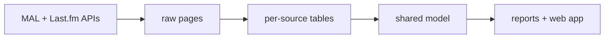

# Taste Engine

A local app that pulls my anime list (MyAnimeList) and listening history (Last.fm) into one SQLite database and shows how my taste compares to everyone else's. Everything runs and stays on my own computer.



## Run it

**Windows:** download the latest zip from [Releases](../../releases), unzip it, and double-click `taste-engine.exe`. The app opens in your browser. Windows warns the first time because the exe isn't signed: click **More info**, then **Run anyway**.

**From source** (Python 3.10+):
```
pip install -r requirements.txt
python -m taste app
```

## Use it

1. Create a profile. Each profile has its own keys, settings, and data.
2. On **Settings**, enter your usernames and API keys: a [MAL client ID](https://myanimelist.net/apiconfig) and a [Last.fm API key](https://www.last.fm/api/account/create). Use **Test connection** to check them.
3. On the **Dashboard**, click **Sync everything**.
4. Open **Reports**.

Keys are stored in Windows Credential Manager, never in plain text on Windows or macOS, and never shown again after saving. Data lives in `%LOCALAPPDATA%\taste-engine` for the packaged app, or `data/` when run from source.

There's also a command line:
```
python -m taste --profile me sync all
python -m taste --profile me report
python -m taste --profile me status
python -m taste profiles
```

## Known limitations

- **Last.fm only sees what scrobbles to it.** Mine only gets desktop plays (Tidal on my PC), not my phone, so my Last.fm data is a sample, not my full listening history. Each profile sets its own capture scope, and every Last.fm report says which scope applies.
- **The MAL list has to be public.** The app uses a client ID only, no login.
- **MAL watch dates are self-reported and often blank.** A completed show without a finish date gets the date I last edited the entry instead, labeled as an estimate. Those estimates cluster on days I bulk-edited my list.
- **Tracks are matched by artist and title**, because MusicBrainz IDs are often missing. Different spellings of the same song count as different tracks.
- **No matching across sources yet** (for example an anime and its soundtrack).

## More

- [docs/PLAN.md](docs/PLAN.md) and [docs/PLAN_APP.md](docs/PLAN_APP.md): design and decisions
- [docs/DATA_DICTIONARY.md](docs/DATA_DICTIONARY.md): every table and column
- [docs/PORTABILITY.md](docs/PORTABILITY.md): moving the SQL to SQL Server
- [docs/RELEASING.md](docs/RELEASING.md): building and publishing releases
- Tests: `pytest` (they never call the real APIs)
